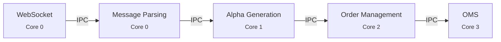
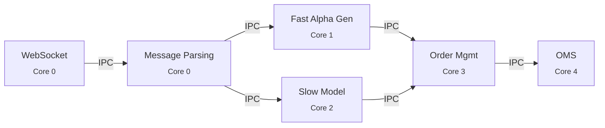

It is always interesting to get feedback from people about my blog articles.
One that a few people have talked to me about is this
[article](https://markrbest.github.io/message-arrival-rates-and-latency/)
on message rates and system throughput.
The main topic of the article was the importance of system throughput to market making platforms and how it relates to system latency.
If you have a very performant system then likely you will not have issues, however that is only one possible solution.

The aim of this article is to elaborate on the topic of throughput, how to make a system more robust, how to avoid bottlenecks and pipeline bubbles.
It is important for specific types of trading which deal with vast quantities of data.
Even if you have a fast system there are still design decisions that you might want to make to reduce the possibility of bottlenecks.

### System Architecture

One important note about event driven HFT architectures is that they rely on a simple principle based on pipelines.
Each system component has its own unique tasks, be it message parsing, book building, alpha generation, order management etc.
Each one of these tasks is normally bound to a cpu/core and the communication done via some form of lockfree IPC.

This is a simple diagram of a trading system layout.
The graph is directional and each component can be cpu bound to make the whole thing more cache efficient.
It is also normal that each step in the pipeline is more complex than the previous one.
This point will become more important later when we talk about decoupling.
It's important that the Order Management part is single threaded since this means there is less likely to be race conditions between orders placement and risk.
The last thing you want is to send taker orders when there are already fills that have not been processed.

### Reducing bottlenecks

#### Reduce complexity

I know a lot of people who use python for HFT (beatz I'm looking at you).
This is fine so long as you know what you are doing and make sure the average processing time is appropriate for the data rate.
The simplest solution to make the amount of inflowing data manageable is to change the subscriptions.
If you are trading low liquidity alt-coins, there is no need for a highly optimised trading system.
(note. some smaller cap coins have insane volumes when they are pumping)
There are aggregate trade feeds and gated order book feeds that are much less demanding to process.
Since order books and trades are the majority of data, if the goal is to reduce the influx of data this is the best place to start.

#### Not all data needs to be process equally

Market data generally has two main types, deltas and snapshots. What does this mean and what does this matter?
If you are listening to an L3 order book feed every update is a change to the order book (insert, cancel etc).
These are deltas (changes) and to have correct picture of the order book, all the deltas need to be processed.
This is the same for trades since each trade is its own unique bit of information.
So for this reason, it is hard to aggregate or skip some of these updates. To deal with delta style feeds, generally the code will need to be fast.

On the other hand snapshot style feeds like L1 (top of book) or L2 feed (price snapshot, order book deltas) can be conflated.
If the message queue has multiple L1 updates, only the latest needs to be processed.
In the case for an L2 update, they can be merged and updates to the same side and price can be conflated.
This means when things are busy the work load can be reduced by skipping or conflating messages.

#### Decouple the producer and consumer

What this means in practical terms is that not every message from the producer needs to lead to a single call to the consumer.
This is especially true if the consumer takes a lot more time to process a message than the producer.
Messages can either be skipped or they can be conflated to reduce the amount of work downstream.
This in practical terms often means reading from the message queue into some form of data structure that can be used to find redundant messages or
to aggregate say trades at the same price.
Once the message queue is empty, or too many messages have been processed, then these cleaned messages can be processed.

The net effect of this is that there should be fewer calls downstream than raw messages from the producer.
This should lead to a lower latency tail if there are bursts of messages.
If there is a bottleneck it should also allow the system to recover more quickly.

#### Split fast path and slow path

Some systems might have a quant model that is quite complex and takes around 100 mics to 1ms+ to compute.
This can be a problem if it needs to be fed raw data as trying to process every tick will lead to problems.

The solution is to split the processing paths.
There is nothing stopping processing from being done on multiple cores.
The producer, consumer pattern is very flexible as it is essentially just a directional graph (be careful of cycles).

The event driven architecture is quite neat due to the message passing and decoupling.
With the slow model, since we know it will need to just take the latest snapshots of books, trades etc it can use a very efficient IPC structure called a SeqLock for communication.
Simply put the slow model can use a loop and process data as quickly as it can and simply publish the latest predictions/forecasts when they are ready.
The order management can then, consume these forecasts as if there were any other update feed.

### Conclusion

I hope this article shows that trading systems can be designed in different ways and that it is ok to not have microsecond tick to trade.
The most important thing is to make sure the data being processed is not stale and bottlenecks are kept to a minimum.
Even if you have a very performant system it is still good to be prepared for the worst possible events.
Hopefully some techniques about here help and lead to you being better able to price and trade consistently irrespective of market conditions.